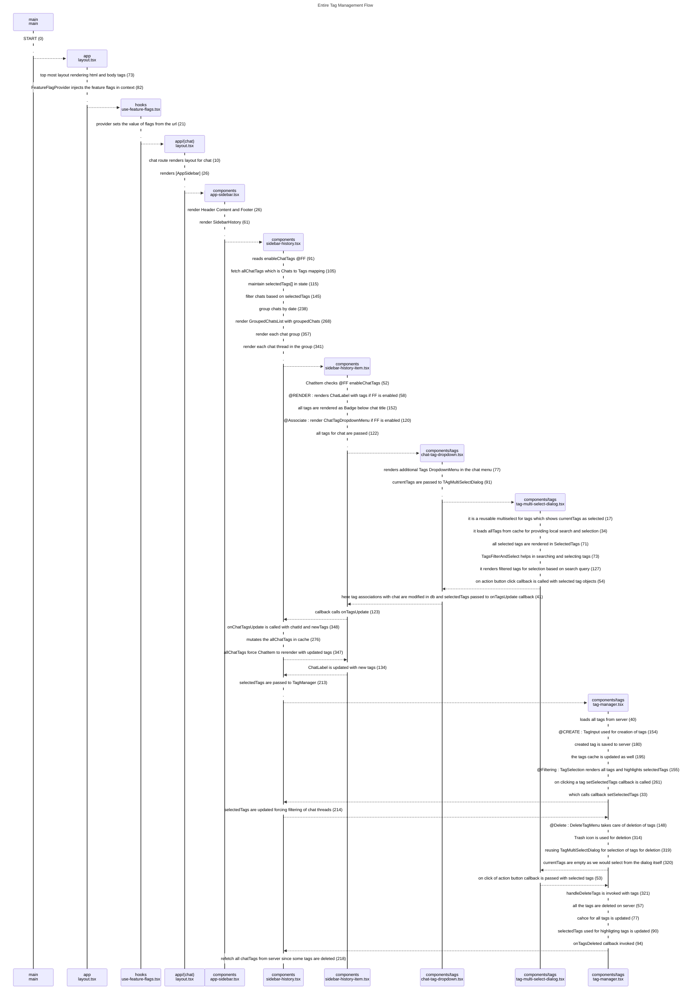

### The code flow diagram for the tag management flow

```mermaid
---
title: "Entire Tag Management Flow"
config:
  themeVariables: 
    actorLineColor: "#000000"
    noteBkgColor: "#FFFFFF"
    noteBorderColor: "#FFFFFF"
  sequence:
    actorMargin: -75
---
	sequenceDiagram
		create participant main as main<br/>main
		Note over main: START (0)
		Note over main: .
		create participant L117 as app<br/>layout.tsx
		main -->> L117: 
		Note over L117: top most layout rendering html and body tags (73)
		Note over L117: FeatureFlagProvider injects the feature flags in context (82)
		Note over L117: .
		create participant UFF as hooks<br/>use-feature-flags.tsx
		L117 -->> UFF: 
		Note over UFF: provider sets the value of flags from the url (21)
		Note over UFF: .
		create participant L115 as app/(chat)<br/>layout.tsx
		UFF -->> L115: 
		Note over L115: chat route renders layout for chat (10)
		Note over L115: renders [AppSidebar] (26)
		Note over L115: .
		create participant AS116 as components<br/>app-sidebar.tsx
		L115 -->> AS116: 
		Note over AS116: render Header Content and Footer (26)
		Note over AS116: render SidebarHistory (61)
		Note over AS116: .
		create participant SH118 as components<br/>sidebar-history.tsx
		AS116 -->> SH118: 
		Note over SH118: reads enableChatTags @FF (91)
		Note over SH118: fetch allChatTags which is Chats to Tags mapping (105)
		Note over SH118: maintain selectedTags[] in state (115)
		Note over SH118: filter chats based on selectedTags (145)
		Note over SH118: group chats by date (238)
		Note over SH118: render GroupedChatsList with groupedChats (268)
		Note over SH118: render each chat group (357)
		Note over SH118: render each chat thread in the group (341)
		Note over SH118: .
		create participant SHI119 as components<br/>sidebar-history-item.tsx
		SH118 -->> SHI119: 
		Note over SHI119: ChatItem checks @FF enableChatTags (52)
		Note over SHI119: @RENDER : renders ChatLabel with tags if FF is enabled (58)
		Note over SHI119: all tags are rendered as Badge below chat title (152)
		Note over SHI119: @Associate : render ChatTagDropdownMenu if FF is enabled (120)
		Note over SHI119: all tags for chat are passed (122)
		Note over SHI119: .
		create participant CTD120 as components/tags<br/>chat-tag-dropdown.tsx
		SHI119 -->> CTD120: 
		Note over CTD120: renders additional Tags DropdownMenu in the chat menu (77)
		Note over CTD120: currentTags  are passed to TAgMultiSelectDialog (91)
		Note over CTD120: .
		create participant TMSD121 as components/tags<br/>tag-multi-select-dialog.tsx
		CTD120 -->> TMSD121: 
		Note over TMSD121: it is a reusable multiselect for tags which shows currentTags as selected (17)
		Note over TMSD121: it loads allTags from cache for providing local search and selection (34)
		Note over TMSD121: all selected tags are rendered in SelectedTags (71)
		Note over TMSD121: TagsFilterAndSelect helps in searching and selecting tags (73)
		Note over TMSD121: it renders filtered tags for selection based on search query (127)
		Note over TMSD121: on action button click callback is called with selected tag objects (54)
		TMSD121 -->> CTD120: 
		Note over CTD120: here tag associations with chat are modified in db and selectedTags passed to onTagsUpdate callback (41)
		CTD120 -->> SHI119: 
		Note over SHI119: callback calls onTagsUpdate (123)
		SHI119 -->> SH118: 
		Note over SH118: onChatTagsUpdate is called with chatId and newTags (348)
		Note over SH118: mutates the allChatTags in cache (276)
		Note over SH118: allChatTags force ChatItem to rerender with updated tags (347)
		SH118 -->> SHI119: 
		Note over SHI119: ChatLabel is updated with new tags (134)
		SHI119 -->> SH118: 
		Note over SH118: selectedTags are passed to TagManager (213)
		Note over SH118: .
		create participant TM122 as components/tags<br/>tag-manager.tsx
		SH118 -->> TM122: 
		Note over TM122: loads all tags from server (40)
		Note over TM122: @CREATE : TagInput used for creation of tags (154)
		Note over TM122: created tag is saved to server (180)
		Note over TM122: the tags cache is updated as well (195)
		Note over TM122: @Filtering : TagSelection renders all tags and highlights selectedTags (155)
		Note over TM122: on clicking a tag setSelectedTags callback is called (261)
		Note over TM122: which calls callback setSelectedTags (33)
		TM122 -->> SH118: 
		Note over SH118: selectedTags are updated forcing filtering of chat threads (214)
		SH118 -->> TM122: 
		Note over TM122: @Delete : DeleteTagMenu takes care of deletion of tags (148)
		Note over TM122: Trash icon is used for deletion (314)
		Note over TM122: reusing TagMultiSelectDialog for selection of tags for deletion (319)
		Note over TM122: currentTags are empty as we would select from the dialog itself (320)
		TM122 -->> TMSD121: 
		Note over TMSD121: on click of action button callback is passed with selected tags (53)
		TMSD121 -->> TM122: 
		Note over TM122: handleDeleteTags is invoked with tags (321)
		Note over TM122: all the tags are deleted on server (57)
		Note over TM122: cahce for all tags is updated (77)
		Note over TM122: selectedTags used for highligting tags is updated (90)
		Note over TM122: onTagsDeleted callback invoked (94)
		TM122 -->> SH118: 
		Note over SH118: refetch all chatTags from server since some tags are deleted (218)
```